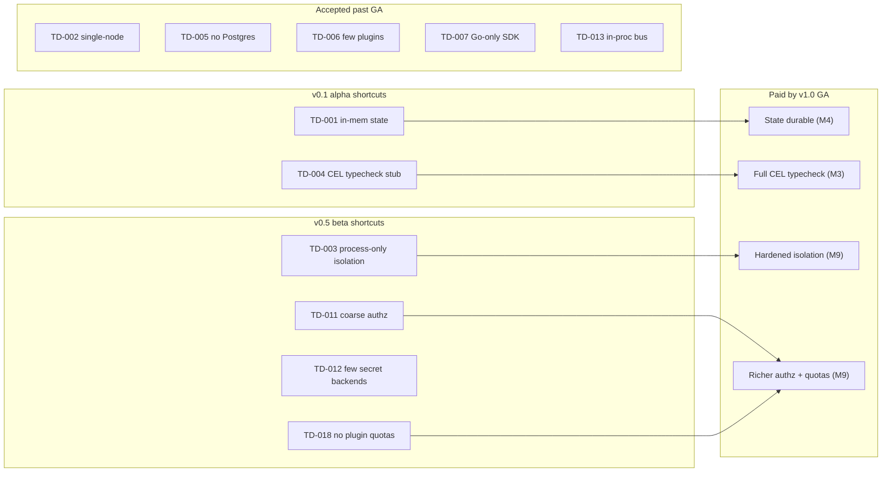

# 98 — Technical Debt Register

> **Platform:** Conduit · **Binary:** `conduit` (alias `cdt`) · **Module:** `github.com/conduit-io/conduit`
> **Go:** 1.24+ · **Status:** Program Baseline v1.0 · **Owner:** TPM / Platform Architecture · **Date:** 2026-07-02

**Related documents:** [95 — Roadmap](95-roadmap.md) · [96 — Milestone Plan](96-milestone-plan.md) · [97 — Risk Register](97-risk-register.md) · [99 — ADRs](99-adrs.md) · [10 — Platform Architecture](10-platform-architecture.md) · [32 — State Management](32-state-management.md) · [72 — Testing Strategy](72-testing-strategy.md)

---

## 1. What this register tracks

This register records **technical debt** — deliberate or accidental shortcuts whose cost is deferred. It covers **anticipated/planned debt** (MVP shortcuts we choose *on purpose* to hit the release train) as well as debt discovered during development. Each item carries the **interest** (the recurring cost of *not* fixing it) so prioritization is economic, not aesthetic.

- **Category:** design · code · test · docs · infra
- **Effort:** S (≤2 days) · M (≤1 week) · L (≤1 sprint) · XL (>1 sprint)
- **Priority:** P0 (GA-blocking) · P1 (should fix pre-GA) · P2 (post-GA) · P3 (nice-to-have)
- **Status:** Planned · Incurred · Scheduled · Paid · Accepted (won't-fix, documented)

**Debt principle:** planned debt is legitimate engineering leverage *only if it is written down, has an interest estimate, and has a target milestone or an explicit "Accepted" decision*. Undocumented shortcuts are defects, not debt.

---

## 2. Register

| ID | Description | Category | Origin | Interest (cost of not fixing) | Remediation | Effort | Priority | Target ([96](96-milestone-plan.md)) | Status |
|---|---|---|---|---|---|---|---|---|---|
| **TD-001** | **In-memory state before persistence** — M1 uses an in-memory `StateStore`; no durability/resume. | design | Planned MVP shortcut ([96 M1](96-milestone-plan.md)) | No crash recovery; runs lost on exit; blocks reliability story. | Implement BoltDB adapter + event log (ADR-0011/0012). | L | P0 | M4 | Planned |
| **TD-002** | **Single-node execution only** — no distributed/multi-node scheduling; `serve` is single daemon. | design | Planned scope boundary ([95 §8](95-roadmap.md)) | Caps scale ceiling; large fleets need external orchestration. | Multi-node scheduler + run leasing (post-GA program). | XL | P2 | post-GA | Accepted |
| **TD-003** | **Limited plugin sandboxing in alpha** — M5 relies on process isolation only; no seccomp/namespacing/resource caps. | design | Planned MVP shortcut ([96 M5](96-milestone-plan.md)) | Weaker blast-radius containment; ties to [RISK-007](97-risk-register.md). | Add cgroup/rlimit caps, optional syscall filtering; harden at M6/M9 ([69](69-threat-model.md)). | L | P1 | M6→M9 | Planned |
| **TD-004** | **CEL typecheck stubbed at M2** — front-end validates syntax but full CEL type-check lands at M3. | code | Sequencing (front-end before engine) | Type errors surface later than ideal; weaker M2 diagnostics. | Wire full CEL type-check into sema ([24](24-semantic-analysis.md),[25](25-expression-engine.md)). | M | P1 | M3 | Planned |
| **TD-005** | **BoltDB only; no Postgres server backend** — server topology deferred. | design | Planned scope boundary ([10 §10](10-platform-architecture.md)) | `conduit serve` multi-run/shared-state unavailable at GA. | Postgres `StateStore` adapter behind existing port. | L | P2 | post-GA | Accepted |
| **TD-006** | **Reference plugins only (`http`,`git`)** — thin capability library at GA. | code | Time-boxed extensibility phase | Users must write plugins for common capabilities early. | Grow first-party plugin set; enable marketplace (post-GA). | XL | P2 | post-GA | Accepted |
| **TD-007** | **Go-only Extension SDK** — no Python/TS/Rust SDKs though gRPC allows them. | design | Planned scope boundary (ADR-0006) | Non-Go authors hand-write proto; slower ecosystem growth. | Publish additional-language SDKs post-GA ([95 §8](95-roadmap.md)). | XL | P2 | post-GA | Accepted |
| **TD-008** | **Static completion fallback** — dynamic completion may ship static for some shells if edge cases slip ([RISK-005](97-risk-register.md)). | code | Contingency reserve | Degraded UX in affected shell; gap vs promise. | Complete dynamic completion for all 4 shells. | M | P1 | M7 | Planned |
| **TD-009** | **Tree-sitter highlighting decoupled from grammar source-of-truth** — `tree-sitter-flow` grammar duplicates Participle grammar; risk of drift. | design | Two grammar formalisms (ADR-0004/0009) | Highlight diverges from parser; maintenance overhead. | Generate/verify tree-sitter grammar against a shared corpus in CI. | M | P1 | M8 | Planned |
| **TD-010** | **No incremental/streaming LSP parse yet** — M8 LSP re-parses on change; may miss latency budget on large files ([RISK-006](97-risk-register.md)). | code | MVP LSP | Editor jank on big `.flow`; NFR risk. | Incremental reparse + AST cache. | M | P1 | M8 | Planned |
| **TD-011** | **Coarse authz policy model at beta** — capability-level allow/deny; no fine-grained attribute conditions. | design | Time-boxed security phase | Limited least-privilege granularity ([RISK-019](97-risk-register.md)). | Extend CEL authz with richer attributes (ADR-0019,[63](63-authorization.md)). | M | P1 | M9 | Planned |
| **TD-012** | **Secrets: env + one backend at beta** — full Vault/keychain matrix deferred. | code | Time-boxed security phase | Fewer secret backends; some users blocked. | Add remaining `SecretResolver` adapters (ADR-0018,[61](61-secrets-management.md)). | M | P2 | M9→post-GA | Planned |
| **TD-013** | **In-proc event bus only** — NATS transport is a port with no adapter at GA. | design | Planned scope boundary ([68](68-message-bus.md)) | No cross-process/distributed eventing; fine for single node. | NATS adapter when distributed exec lands (post-GA). | L | P2 | post-GA | Accepted |
| **TD-014** | **Sparse integration-test corpus early** — heavy unit focus in P1/P2; broad E2E matrix matures later. | test | Sequencing | Integration regressions caught late. | Expand E2E/soak/fuzz corpus ([72](72-testing-strategy.md)). | L | P1 | M8 | Planned |
| **TD-015** | **Manual release steps in early pipeline** — signing/changelog partly manual until CI/CD matures. | infra | Bootstrapping ([81](81-build-release-cicd.md)) | Release toil + human error risk. | Fully automate build/sign/publish (goreleaser + cosign). | M | P1 | M6 | Planned |
| **TD-016** | **Docs authored by hand before docs-gen** — reference docs manual until `conduit docs` (M8). | docs | Sequencing ([43](43-documentation-generation.md)) | Doc drift ([RISK-022](97-risk-register.md)); duplicated effort. | Generate reference from metadata/catalog. | M | P2 | M8 | Planned |
| **TD-017** | **`maxParallel` heuristics untuned** — default parallelism not empirically calibrated early. | code | MVP executor | Sub-optimal throughput or oversubscription. | Benchmark-driven defaults + adaptive sizing ([73](73-performance-scalability.md)). | S | P2 | M9 | Planned |
| **TD-018** | **No plugin resource quotas at alpha** — plugins can consume unbounded CPU/mem. | design | Planned MVP shortcut | Noisy-neighbor / DoS via plugin ([RISK-007](97-risk-register.md)). | Per-plugin rlimits + timeouts + circuit breaker. | M | P1 | M9 | Planned |
| **TD-019** | **Config schema not independently versioned early** — `conduit.yaml` schema evolves ad hoc until version streams land. | design | Sequencing (ADR-0015) | Breaking config changes without migration path. | Version + migrate config schema stream ([60](60-configuration.md),[83](83-api-standards-versioning.md)). | S | P1 | M9 | Planned |
| **TD-020** | **Error-code catalog incomplete early** — typed `ConduitError` codes grow reactively. | code | Bootstrapping ([70](70-error-handling.md)) | Inconsistent error UX / weaker machine-readability for agents. | Consolidate + document code catalog. | S | P2 | M9 | Planned |

---

## 3. Planned (anticipated) debt summary

These are the **deliberate MVP shortcuts** the program takes to hit the release train, with their pay-back checkpoints:

**GA gate:** no **P0** debt may be open at [M9](96-milestone-plan.md); every **P1** item must be Paid or explicitly re-classified **Accepted** with owner sign-off; **P2/Accepted** items are documented in the post-GA outlook ([95 §8](95-roadmap.md)).

---

## 4. Debt-management policy

### 4.1 Budget (ratchet)
- **Capacity allocation:** at least **20% of each sprint's engineering capacity** is reserved for debt paydown and quality (the "quality budget"). During Q4 hardening this rises to ~40%.
- **Ratcheting rule:** new **P0/P1** debt may only be incurred if an equal-or-greater unit of existing debt is scheduled for the *same or next* milestone. Net debt trends **down** quarter over quarter into GA.
- **Coverage ratchet:** the CI coverage floor only ever increases across milestones (60% → 78%, [96 §5](96-milestone-plan.md)); it is never lowered to make a build pass.

### 4.2 Review cadence
- **Every PR:** author declares any new shortcut with a `TD-###` reference; reviewers reject undocumented shortcuts (they are defects, not debt).
- **Every milestone gate:** TPM + leads review the register, re-score priority, and confirm P0/P1 targets ([96](96-milestone-plan.md)).
- **Monthly:** trend review — net debt, aging P1 items, and debt-to-feature ratio.

### 4.3 Intake & lifecycle
1. **File** with description, category, origin, interest, remediation, effort, target milestone.
2. **Triage** to a priority; link to related [risks](97-risk-register.md) and [ADRs](99-adrs.md).
3. **Schedule** into a milestone or mark **Accepted** (with rationale + owner).
4. **Pay** and mark **Paid** with the PR reference; verify interest is eliminated.

### 4.4 Escalation
- Any debt that becomes **GA-blocking** is re-classified **P0** and escalated to the TPM immediately.
- Debt that materializes a live risk is cross-linked and tracked jointly in [97 — Risk Register](97-risk-register.md).
