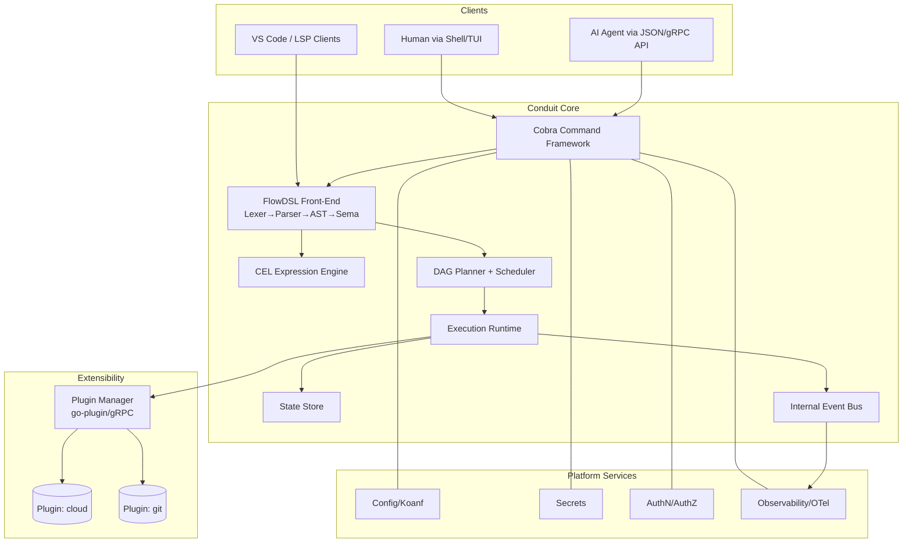

# Conduit — Enterprise CLI & Automation Platform

> **Codename:** Conduit · **Binary:** `conduit` (alias `cdt`) · **Module:** `github.com/conduit-io/conduit`
> **Status:** Architecture & Design Baseline v1.0 · **Owner:** Platform Architecture · **Date:** 2026-07-02

Conduit is a next-generation, Go-based CLI and automation platform. It combines an extensible command
framework, a purpose-built workflow DSL (**FlowDSL**, files: `*.flow`), a DAG execution engine, a
secure plugin architecture, first-class shell/IDE integration, and AI-agent-consumable APIs.

---

## Canonical Conventions (authoritative for all documents)

| Concept | Decision |
|---|---|
| Platform name | **Conduit** |
| CLI binary | `conduit` (short alias `cdt`) |
| Go module path | `github.com/conduit-io/conduit` |
| Go version | **1.24+** |
| DSL name | **FlowDSL** |
| DSL file extension | `.flow` |
| DSL MIME | `application/vnd.conduit.flow` |
| Config file | `conduit.yaml` (also `.conduit/config.yaml`) |
| CLI framework | **Cobra** |
| Config loader | **Koanf** |
| DSL parser | **Participle v2** |
| Expression engine | **CEL-Go** |
| Plugin system | **HashiCorp go-plugin** (gRPC transport) |
| TUI | **Bubble Tea** (+ Lip Gloss / Bubbles) |
| Language Server | Custom **LSP** server (`conduit lsp`) |
| Syntax highlighting | **Tree-sitter** grammar (`tree-sitter-flow`) |
| Versioning | **SemVer 2.0.0** |
| RFC keywords | MUST/SHOULD/MAY per **RFC 2119 / RFC 8174** |

### ID conventions
- Functional requirements: `FR-###`
- Non-functional requirements: `NFR-###`
- Security requirements: `SEC-###`
- Architecture Decision Records: `ADR-####`
- Risks: `RISK-###`
- Tech debt items: `TD-###`
- Threats: `THREAT-###` (STRIDE-classified)

### Diagram convention
All diagrams are authored in **Mermaid** fenced code blocks so they render in GitHub/VS Code.

---

## Document Index

### Product & Requirements
- [00 — Executive Summary](00-executive-summary.md)
- [01 — Product Vision](01-product-vision.md)
- [02 — Product Requirements Document (PRD)](02-prd.md)
- [03 — Functional Requirements](03-functional-requirements.md)
- [04 — Non-Functional Requirements](04-non-functional-requirements.md)
- [05 — Security Requirements](05-security-requirements.md)

### Architecture
- [10 — Platform Architecture](10-platform-architecture.md)
- [11 — Component Architecture](11-component-architecture.md)
- [12 — Domain Model](12-domain-model.md)
- [13 — Data Models](13-data-models.md)

### DSL & Language Front-End
- [20 — DSL Grammar Specification](20-dsl-grammar.md)
- [21 — Lexer Design](21-lexer-design.md)
- [22 — Parser Design](22-parser-design.md)
- [23 — AST Design](23-ast-design.md)
- [24 — Semantic Analysis Design](24-semantic-analysis.md)
- [25 — Expression Engine Integration (CEL)](25-expression-engine.md)

### Workflow, Runtime & State
- [30 — Workflow DAG Design](30-workflow-dag.md)
- [31 — Execution Runtime Design](31-execution-runtime.md)
- [32 — State Management Design](32-state-management.md)

### Extensibility
- [40 — Plugin Architecture](40-plugin-architecture.md)
- [41 — Extension SDK](41-extension-sdk.md)
- [42 — Command Metadata Model](42-command-metadata.md)
- [43 — Documentation Generation Framework](43-documentation-generation.md)
- [44 — Public SDK Design](44-public-sdk.md)
- [45 — Integration Guide (Embedding Conduit in Your Go CLI)](45-integration-guide.md)

### Completion, IntelliSense & IDE
- [50 — Completion Engine Design](50-completion-engine.md)
- [51 — Bash Completion Architecture](51-bash-completion.md)
- [52 — ZSH Completion Architecture](52-zsh-completion.md)
- [53 — Fish Completion Architecture](53-fish-completion.md)
- [54 — PowerShell Completion Architecture](54-powershell-completion.md)
- [55 — IntelliSense Architecture](55-intellisense.md)
- [56 — LSP Architecture](56-lsp-architecture.md)
- [57 — VS Code Extension Architecture](57-vscode-extension.md)
- [58 — Tree-sitter Grammar Architecture](58-tree-sitter-grammar.md)

### Configuration, Security & Trust
- [60 — Configuration Architecture](60-configuration.md)
- [61 — Secrets Management Design](61-secrets-management.md)
- [62 — Authentication Architecture](62-authentication.md)
- [63 — Authorization Architecture](63-authorization.md)
- [69 — Threat Model](69-threat-model.md)

### Observability & Messaging
- [64 — Observability Architecture](64-observability.md)
- [65 — Logging Architecture](65-logging.md)
- [66 — Telemetry Architecture](66-telemetry.md)
- [67 — Event Model](67-event-model.md)
- [68 — Internal Message Bus](68-message-bus.md)

### Reliability & Quality
- [70 — Error Handling Strategy](70-error-handling.md)
- [71 — Recovery Strategy](71-recovery-strategy.md)
- [72 — Testing Strategy (Unit/Integration/Plugin/DSL)](72-testing-strategy.md)
- [73 — Performance & Scalability Strategy](73-performance-scalability.md)

### Engineering System
- [80 — Reference Repository Structure / Module / Package Layout](80-repository-structure.md)
- [81 — Build / Release / CI-CD Pipeline](81-build-release-cicd.md)
- [82 — Developer Experience Design](82-developer-experience.md)
- [83 — API Standards / Versioning / Compatibility / Migration](83-api-standards-versioning.md)

### Samples & Diagrams
- [90 — Sample Workflows](90-sample-workflows.md)
- [91 — Sample DSL Files](91-sample-dsl-files.md)
- [92 — Sample Plugin Implementations](92-sample-plugins.md)
- [93 — Sequence Diagrams](93-sequence-diagrams.md)

### Program Management
- [95 — 12-Month Engineering Roadmap](95-roadmap.md)
- [96 — Milestone Plan](96-milestone-plan.md)
- [97 — Risk Register](97-risk-register.md)
- [98 — Technical Debt Register](98-tech-debt-register.md)
- [99 — Architecture Decision Records (ADRs)](99-adrs.md)

---

## How the pieces fit (context diagram)

